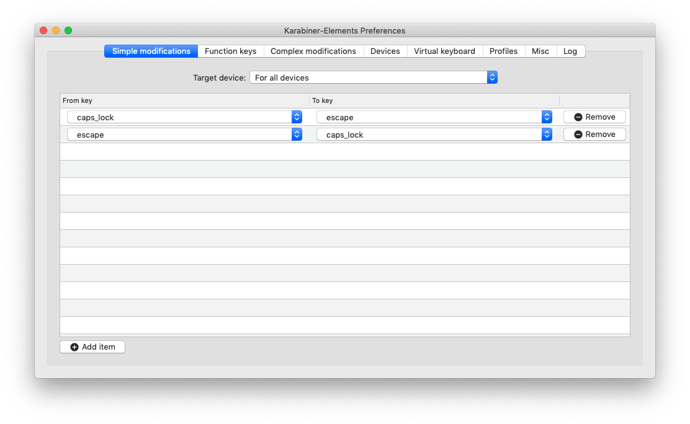
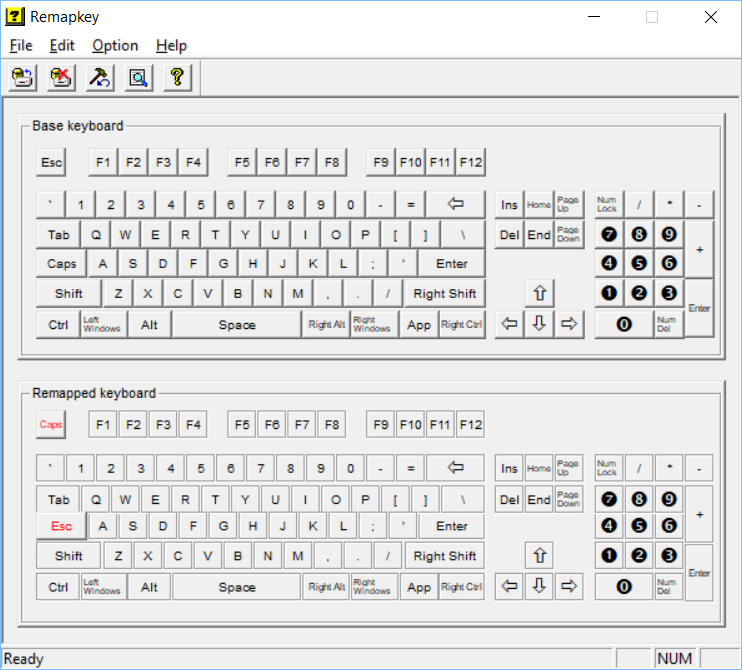

# dotfiles

My configuration files: Vim, Bash, tmux, and some VS Code stuff

## **macOS**  

- To enable key repeats in VS Code for Vim extension, type these commands into Terminal:  

```sh
defaults write com.microsoft.VSCode ApplePressAndHoldEnabled -bool false  
defaults delete -g ApplePressAndHoldEnabled  # If necessary, reset global default  
```

- Remap <kbd>caps lock</kbd>&rightarrow;<kbd>esc</kbd> &nbsp; &
 &nbsp; <kbd>esc</kbd>&rightarrow;<kbd>caps lock</kbd>  

  1. Install [Karabiner Elements](https://pqrs.org/osx/karabiner/)

  2. Create the simple modifications shown below:  
  

- Clone dotfiles

```sh
git clone https://github.com/philimat/dotfiles.git
```

- Install [iTerm2](https://iterm2.com)

  - Apply Gruvbox-dark Colorscheme

    iTerm2 &rightarrow; Preferences &rightarrow; Profiles &rightarrow;
    Other actions... &rightarrow; import JSON Profiles... &rightarrow;
    "/Users/mattphilippi/dotfiles/schemes/gruvbox/Gruvbox-dark.json"

  - Fix some keymappings

    iTerm2 &rightarrow; Preferences &rightarrow; Keys &rightarrow;
    Presets... &rightarrow; Import... &rightarrow;
    "/Users/mattphilippi/dotfiles/vim.itermkeymap"

- Install Vim

  ```sh
  brew install macvim
  ```  

- Homebrew  

  - First, install Homebrew.  

  ```sh
  /usr/bin/ruby -e "$(curl -fsSL https://raw.githubusercontent.com/Homebrew/install/master/install)"
  ```  

  - Make sure Homebrew is up to date.  

  ```sh
  brew update
  ```  

  - Follow any brew doctor recommendations  

  ```sh
  brew doctor
  ```  

  - Add Homebrew's location to your `$PATH` in your `.bash_profile` or `.zshrc`
  file.  

  ```sh
  export PATH="/usr/local/bin:$PATH"
  ```  

```sh
brew install tmux
```

- Install vim-plug

```sh
curl -fLo ~/.vim/autoload/plug.vim --create-dirs \
https://raw.githubusercontent.com/junegunn/vim-plug/master/plug.vim
```

- Install dotfiles

```sh
cd ~/dotfiles
./install.sh
cd
```

- Install tpm

```sh
git clone https://github.com/tmux-plugins/tpm ~/.tmux/plugins/tpm
tmux
```

- Install tmux plugins

`prefix`+<kbd>I</kbd>  

- Install Node.js  

```sh
brew install node
```  

- Install Nerd Fonts for NERDTree to work with vim-devicons  

```sh
brew tap homebrew/cask-fonts
brew cask install font-hack-nerd-font
```

Terminal &rightarrow; Preferences &rightarrow; Profiles &rightarrow;
\<Default profile\> &rightarrow; Text &rightarrow; Change ... &rightarrow;
Family &rightarrow; Hack Nerd Font

- Install vim plugins

```sh
vim -E -c PlugInstall -c qa
```

## **Ubuntu**

- Remap <kbd>caps lock</kbd>&rightarrow;<kbd>esc</kbd> &nbsp; &
 &nbsp; <kbd>esc</kbd>&rightarrow;<kbd>caps lock</kbd>  

  1. Install **Gnome Tweak Tool**:  

    ```sh
    sudo apt-get install gnome-tweak-tool
    ```

  2. Keyboard & Mouse &rightarrow; Additional Layouts Options &rightarrow; Caps
  Lock Behavior &rightarrow; Swap ESC & Caps Lock

- Install Vim

  ```sh
  sudo apt-get install vim
  ```  

## **Windows Subsystem for Linux (Ubuntu 18.04)**

- Install WSL Ubuntu 18.04

- Remap <kbd>caps lock</kbd>&rightarrow;<kbd>esc</kbd> &
  <kbd>esc</kbd>&rightarrow;<kbd>caps lock</kbd>  

  1. Install [Windows Server 2003 Resource
     Kit](https://www.microsoft.com/en-us/download/details.aspx?id=17657) 

  2. Navigate to *C:\Program Files (x86)\Windows Resource Kits\Tools*

  3. Run as Administrator *remapkey.exe*

  4. Change keys as shown below:



  5. Save and Exit

  6. Reboot  

[w]:images/windows_icon.png
[l]:images/linux_icon.png
[m]:images/macOS_icon.png
